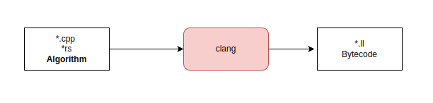
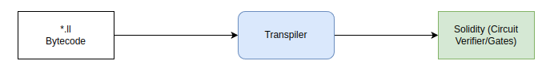
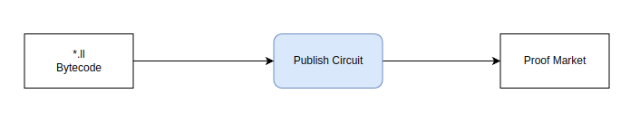
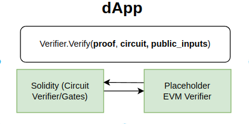

# zkLLVM Circuit Compiler

[](
https://github.com/NilFoundation/zkllvm/actions/workflows/build_linux.yml)

[](https://discord.gg/KmTAEjbmM3)
[](https://t.me/nilfoundation)
[](https://twitter.com/nil_foundation)

zkLLVM is a compiler from high-level programming languages into an input for provable computations protocols. 
It can be used to generate input for any arbitrary zero-knowledge proof system or protocol, which accepts 
input data in form of algebraic circuits It assumed to be used together with `Placeholder` proof system or 
any other arithmetization compatible with `Placeholder` proof system.

Every proof output from zkLLVM is **an in-EVM verifiable** one through the [Proof Market](https://proof.market). Use the Proof Market Toolchain repository (https://github.com/NilFoundation/proof-market-toolchain) to generate in-EVM verifiers.

**Notice**: zkLLVM is **NOT** a virtual machine and has nothing to do with it. It, moreover, with its existence proves the absence of necessity in zkVMs, posing them as redundant.

zkLLVM is designed as an extension to LLVM toolchain, thus supports any front end which compiles to LLVM IR. This 
enables developers to write code in native language instead of DSL's specific to other libraries.

zkLLVM extends:
1. `clang/clang++` : Compiles the program into general intermediate representation byte-code from C/C++.
2. `rustc`: Compiles the program into general intermediate representation byte-code from Rust. (https://github.com/NilFoundation/zkllvm-rslang)
3. `assigner` Creates the circuit execution trace (a.k.a. assignment table) and produces data, needed by the prover to produce proof.

Languages currently supported are:
1. C/C++ (all the standards Clang 15 supports).
2. Rust (https://github.com/NilFoundation/zkllvm-rslang).
3. Your language suggestions are warmly welcomed in Telegram (https://t.me/nilfoundation) or on Discord (https://discord.gg/KmTAEjbmM3).

## Building

### Unix

#### Install Dependencies

* [Boost](https://www.boost.org/) >= 1.76.0
* [CMake](https://cmake.org/) >= 3.5
* [Clang](https://clang.llvm.org/) >= 12.0

On Debian systems, everything except Boost can be installed with the following command:

```
sudo apt install build-essential libssl-dev cmake clang-12 git
```

#### 1. Clone the repository

Clone the repository and all the submodules via:

```
git clone --recurse-submodules git@github.com:NilFoundation/zkllvm.git
cd zkllvm
```

#### **2. Configure CMake**

```bash
cmake -G "Unix Makefiles" -B ${ZKLLVM_BUILD:-build} -DCMAKE_BUILD_TYPE=Release .
```

Proof Market requires the IR files in the *.ll format. If you are generating circuit/statement
to publish on proof market. Please use the below command instead.

```
cmake -G "Unix Makefiles" -B ${ZKLLVM_BUILD:-build} -DCMAKE_BUILD_TYPE=Release -DCIRCUIT_ASSEMBLY_OUTPUT=TRUE .
```

**3. Build the compiler**

```bash
make -C ${ZKLLVM_BUILD:-build} assigner clang -j$(nproc)
```

## Usage

zkLLVM's workflow is as follows:

1. **Write Circuit :** Users willing to prove some statement are supposed to implement an application in a language compatible with some frontend (C++ for now). This code will be compiled with a modified version of the `clang` compiler, which will output intermediate representation of the circuit.
   
   > For the most performant cryptography circuits (e.g. hashes, signatures, VDFs, proof system verifications, etc.) 
   > we recommend using [=nil; Foundation's Crypto3 library](https://github.com/nilfoundation/crypto3.git).

   
  The circuit developer will be generating the in-EVM applications for the circuits they have created. This will enable on-chain verification of the proof. 
  The in-EVM logic consists of gate representations of the circuit. These contracts work in conjunction with the Placeholder proof validation in-EVM logic.
  The process to transpile the circuit into smart contracts is handled by the [lorem-ipsum](https://github.com/NilFoundation/lorem-ipsum-cli)
  project.

2. **Publish Circuit/Generate Proof**: zkLLVM is tightly coupled with [=nil; Foundation's Proof Market](https://proof.market.nil.foundation). Users willing to generate a proof for the circuit, will be matched with counter-parties based on price and other conditions.
   The circuit generated above needs to be published to proof market to enable this. 
   
 
To generate a proof it is required to pass the following to the proof generator:

    * Circuit : Arithmetization of the circuit.
    * Inputs: Public (and private) inputs to circuit part of the proof request. 

This generates the binary proof file. This flow is handled by the [proof market toolchain](https://github.com/NilFoundation/proof-market-toolchain) repository & documented [here](https://docs.nil.foundation/proof-market/market/user-guides/proof-producer).   

Users can generate & inspect intermediate artifacts such as execution trace by running the `assigner` process. See examples below.

3. **Verify Proof**: Proof can be retrieved from the proof market and verified on chain. Users can verify proof in these modes : 
   1. Offline : Tooling to support validation of off-chain proof will be added in the future.
   2. On-chain : This flow of generating smart contracts is handled by the [lorem-ipsum](https://github.com/NilFoundation/lorem-ipsum-cli) project. A high level flow is described in the guides 
   for [circuit developer](https://docs.nil.foundation/zkllvm/manual/getting-started/circuit-generation) & [proof verifier](https://docs.nil.foundation/zkllvm/manual/getting-started/proof-verifier)
   described above.   
    
   
   Above we see how a dApp can use generated verifiers on-chain by simply including verification interfaces. 
    
### Examples

#### Linux 

```bash
make -C ${ZKLLVM_BUILD:-build} circuit_examples -j$(nproc) 
${ZKLLVM_BUILD:-build}/bin/assigner/assigner -b ${ZKLLVM_BUILD:-build}/examples/arithmetics_example.ll -i examples/arithmetics.inp -t assignment.tbl -c circuit.crct -e pallas
```

#### macOS
```bash
make -C ${ZKLLVM_BUILD:-build} circuit_examples -j$(sysctl -n hw.logicalcpu)
${ZKLLVM_BUILD:-build}/bin/assigner/assigner -b ${ZKLLVM_BUILD:-build}/examples/arithmetics_example.ll -i examples/arithmetics.inp -t assignment.tbl -c circuit.crct -e pallas
```
