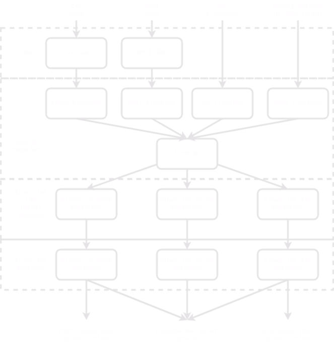

# What is zkLLVM?

zkLLVM directly transforms the code into a different representation. The transformation process is based on the LLVM optimizations, so the code is being simplified optimized for the circuit form.

Is is design to be able to work with different zk-SNARK of zk-STARK arithmetizations (a.k.a circuit representations). Current version is based on the PLONKish circuit components library of ours called [blueprint](https://github.com/NilFoundation/zkllvm-blueprint), but it can be easily extended to work with other libraries - C++ or RUST ones - by writing small part of the whole compiler pipeline. We will discuss arithmetizations and arithmetization change in more details in the [Architecture section]().

The pipeline of the compiler is the following: 

- Write the code in C/C++ or Rust. It’s a straightforward process because you can use the code you already have. It’s not required to rewrite the code from scratch, you need to add a few annotations, and that’s it. You can find more details in the [Circuit Development section](). Optionally, you can use the code from the SDK, which already contains many circuit-friendly algorithms implementations and will allow you to reduce the development costs.

- Once you’ve written the code, you need to compile it into a circuit. It takes only a few seconds - the compiler transforms the code into another form without additional instructions or overhead. Everything is done by a simple command line tool, which is a replacement for clang and rustc. You can use it as a part of your development environment or CI/CD pipeline.

- The generated circuit can be used as input for the `assigner` tool. It takes the circuit and the input and generates the assignment (a.k.a the execution trace). The `assigner` tool is a part of the installation package and can be used as a part of your development environment or CI/CD pipeline as well.

